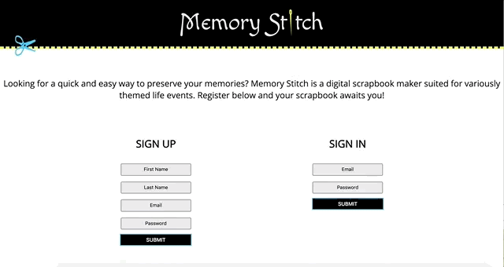

# A Digital Scrapbook Maker - Memory Stitch

This was our first collaborative project using the following tech-stack:

Javascript, React.js, Redux, Node.js, Express.js, PostgreSQL, HTML, and CSS

We built a digital scrapbook maker named "Memory Stitch". The goal of this project was to create an MVP in one week. This single-page application allows a user to choose variously themed templates and upload photos into designated fields. The user can also customize his/her scrapbooks through color choice and the option to add multiple pages. This app is virtually interactive; when a photo is clicked on, a modal opens displaying the image enlarged. Eventually, the modal will also contain a text area for uploading captions and descriptions.

The user begins at the sign up and registration page:

Then user has the option to add a new scrapbook, as well as to choose a color and theme. Once the specs of this scrapbook is built, photos can be uploaded:

After the user has finished choosing pictures, the completed scrapbook can be reviewed and photos can be clicked on and seen in a larger size:

